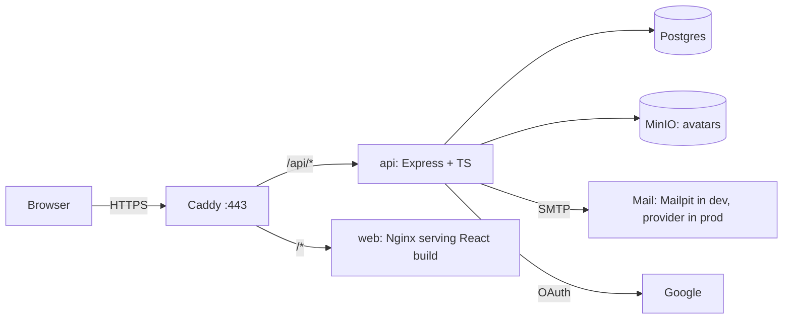

# Master Plan — UrConnections v2 (TypeScript · Express · Postgres · Docker)

**Goal:** Move from "React + Supabase" to a stack the owner writes, understands, and runs end to end:
a TypeScript monorepo with an Express API, your own authentication, Postgres, Docker, and self-hosted deployment.
**Why:** to learn by building. Every stage lists what you'll learn, and the code is explained as it's written.

**How to use this file:** do the stages **in order**, **one branch and one PR per stage** (`stage-03-docker-dev`, …).
Each stage ends in something you can run and see working. The v1 site stays on Supabase and Vercel until **Stage 16**, so nothing breaks while you learn. **No data is migrated**: v1 only has the owner's test data, so v2 starts fresh from the seed script and real content created after launch.
When a stage is done, tick it in the [progress table](#progress) and note anything surprising.

Audit IDs (B, S, D, O, P, A…) refer to [CODE_AUDIT.md](CODE_AUDIT.md). This plan replaces Phases 2–6 of [REFACTOR_ROADMAP.md](REFACTOR_ROADMAP.md), and those audit items are folded into the stages below.

---

## 1. Decisions

| Topic | Choice | Why |
|---|---|---|
| Language | **TypeScript everywhere**, `strict: true` from day one | Catches the bug class we kept fixing (null fields, wrong props). Shared types between API and UI. |
| Repo layout | **Monorepo with npm workspaces**: `web/`, `api/`, `packages/shared/` | One install and one repo. The shared package holds schemas and types used by both sides. |
| API | **Node.js (current LTS) + Express 5** | The most learning material available. Express 5 handles async errors natively. |
| Validation | **zod**, in `packages/shared` | One schema validates the API request **and** the React form, and gives the TS type via `z.infer`. |
| Database | **PostgreSQL** (latest stable) in Docker | Same database as today. The data is relational (users ↔ groups ↔ future members). |
| DB access | **Kysely** (type-safe SQL query builder) + **SQL migrations** | Reads like SQL, so you learn SQL rather than an ORM's magic, and it's fully typed. |
| Passwords | **argon2id** (`argon2` package) | Current best practice. Only argon2id is needed, since there are no old accounts to import. |
| Sessions | **Server-side sessions in Postgres**, random token in an `httpOnly; Secure; SameSite=Lax` cookie | Simpler and safer than JWT in localStorage: XSS can't read it, and logout really revokes it. |
| Google login | **`arctic`** (small OAuth 2.0 library) with state + PKCE | You write the flow yourself; the library only handles the protocol details. |
| Email | **nodemailer**. **Mailpit** catches all mail in dev. Any SMTP provider in prod | See every email locally without sending real mail. |
| File storage | **MinIO** (S3-compatible) in Docker. Images converted to WebP with **sharp** on the server | Learn the S3 API, which is the same as AWS. Server-side conversion closes S5 for good. |
| Tests | **Vitest** (both sides) + **Supertest** (API) + React Testing Library | Vite-native and fast. |
| Logging | **pino** (JSON logs) + request IDs | Production-grade logs from the start. |
| Containers | **Docker** multi-stage images + **Docker Compose** (dev and prod files) | The core deployment skill. |
| Hosting | One **VPS** (Hetzner/DigitalOcean, about $5–10/month), **Caddy** reverse proxy with automatic HTTPS | Full control, the most to learn, and cheap. |
| Routing in prod | Caddy serves **one domain**: `/api/*` → API container, everything else → web container | Same origin means **no CORS** and simple cookies. |
| CI/CD | **GitHub Actions**: lint + typecheck + test on every PR, then build images → GHCR → deploy over SSH | Automated, repeatable deploys. |

---

## 2. Target architecture



```
Find_Study/
  package.json            # npm workspaces root: scripts that run across all packages
  tsconfig.base.json      # shared strict TS settings
  docker-compose.yml      # dev: postgres, mailpit, minio (+ api/web optional)
  compose.prod.yml        # prod: caddy, web, api, postgres, minio, backup
  Caddyfile
  .github/workflows/      # ci.yml, deploy.yml
  packages/shared/src/    # zod schemas + inferred types + constants (topics, platforms, countries)
  api/src/
    index.ts              # starts the server
    app.ts                # builds the Express app (imported by tests)
    config.ts             # env vars validated with zod: crash early if misconfigured
    db/                   # kysely instance, generated types, migrations/
    modules/
      auth/               # routes, service, sessions, passwords, oauth, emails
      groups/             # routes, service, repository
      users/              # profile, avatar
    middleware/           # requireAuth, validate(schema), errorHandler, rateLimit, originCheck
    lib/                  # logger, mailer, storage (S3 client)
  web/src/                # today's app, converted to TS (same feature folders)
```

### Data model (target)
```sql
users          (id uuid pk, email citext unique, password_hash text null, email_verified_at timestamptz null,
                display_name text, phone text, country text, city text, avatar_key text null,
                created_at, updated_at)
oauth_accounts (provider text, provider_user_id text, user_id uuid fk → users, pk(provider, provider_user_id))
sessions       (id_hash text pk, user_id uuid fk, expires_at timestamptz, created_at, user_agent text, ip inet)
email_tokens   (token_hash text pk, user_id uuid fk, purpose text check in ('verify','reset'),
                expires_at timestamptz, used_at timestamptz null)
groups         (id uuid pk, user_id uuid fk → users on delete cascade, title, description, topic, platform,
                meeting_link, country, city, created_at)   -- + the CHECK constraints from Phase 1
indexes: groups(country, city), groups(topic), groups(platform), groups(user_id), sessions(user_id)
```
Tokens (session, verify, reset) are random 32 bytes. **Only their SHA-256 hash is stored**, so a leaked database can't be used to log in.

### API (target)
| Method | Path | Auth | Purpose |
|---|---|---|---|
| GET | `/api/health` | – | liveness and DB check |
| POST | `/api/auth/register` | – | create account, send verification email |
| POST | `/api/auth/login` | – | email + password → session cookie |
| POST | `/api/auth/logout` | ✔ | delete the session |
| GET | `/api/auth/me` | – | current user or `null` (replaces `getSession`) |
| POST | `/api/auth/verify-email` | – | consume the verify token |
| POST | `/api/auth/forgot-password` · `/reset-password` | – | reset flow |
| GET | `/api/auth/google` · `/google/callback` | – | OAuth redirect and callback |
| GET | `/api/groups?query&topic&country&city&platform&cursor` | – | **server-side filtering + pagination** (P4) |
| GET | `/api/groups/:id` | – | detail |
| POST | `/api/groups` | ✔ | create (owner = session user) |
| DELETE | `/api/groups/:id` | ✔ owner | delete |
| GET | `/api/users/me/groups` | ✔ | my groups |
| PATCH | `/api/users/me` | ✔ | update profile |
| PUT · DELETE | `/api/users/me/avatar` | ✔ | upload (multipart) / remove |

---

## 3. Ground rules for every stage
1. Branch `stage-XX-name` from `dev`. Keep the PR small. Merge only when `npm run lint && npm run typecheck && npm test` pass.
2. **No secrets in git.** Every service reads env vars validated by `config.ts`. Commit a `.env.example`.
3. Each stage updates the docs it touches (this file's progress table, ARCHITECTURE.md, CODE_AUDIT.md statuses).
4. Claude explains the *why* for each new concept as it's written, and flags security-critical code with `// SECURITY:` comments.
5. Prefer boring, well-known libraries for anything cryptographic. **Never hand-roll crypto.**

---

## 4. Stages

### Stage 0 — Freeze the current version
- Commit Phases 0–1 on `dev`, merge to `main`, and tag **`v1-supabase`** (a safe point to return to).
- Decide what happens to the v1 site while v2 is built. It only holds test data, but while it's online anyone can sign up, post groups, or upload files:
  - keep it up as a demo → run the two Phase 1 migrations ([SUPABASE.md](SUPABASE.md), about 10 minutes), **or**
  - nobody needs it → **pause the Supabase project** in its dashboard (the Vercel site then just shows errors, which you can take down too).
- **Done when:** the tag exists, and the v1 site is either hardened or paused.

### Stage 1 — Monorepo + TypeScript foundation
**You'll learn:** npm workspaces, `tsconfig` (strict, `moduleResolution`, project references), ESLint for TS.
- Move the app into `web/` (with `git mv`, so history is kept). Root `package.json` with `"workspaces": ["web", "api", "packages/*"]`.
- `tsconfig.base.json` (strict) plus a `web/tsconfig.json` with `allowJs: true`, so JS and TS can live side by side during the conversion.
- `typescript-eslint` added to the flat config. Root scripts: `lint`, `typecheck`, `test`, `dev`.
- Create `packages/shared` (empty `index.ts`) and import it from `web` to prove the wiring.
- **Done when:** `npm install && npm run dev` still runs the Supabase app, and `npm run typecheck` passes.

### Stage 2 — Shared schemas + typed data layer (frontend still on Supabase)
**You'll learn:** TS basics (types, unions, generics, `as const`), `z.infer`, typing hooks and React Query.
- Move into `packages/shared`: `groupSchema` → `createGroupSchema` + `Group` type, `TOPICS` (D5), `PLATFORMS` keys (icons stay in web), countries (O7: pre-sorted data), and the profile and auth schemas (O3: separate `loginSchema` / `signupSchema`).
- Convert `web/src/lib`, `services`, and all `hooks` to `.ts`. Add query-key factories (D7).
- **Done when:** the data layer is 100% TS with no `any`, and the forms use the shared schemas.

### Stage 3 — Docker dev environment + API skeleton + CI
**You'll learn:** images vs containers, volumes, networks, Compose, health checks, env validation, the Express request lifecycle, GitHub Actions.
- `docker-compose.yml`: `postgres` (with a named volume), `mailpit` (UI on :8025), `minio` (console on :9001).
- `api/`: Express 5 + TS, run with `tsx watch` in dev. `config.ts` (zod-validated env), `app.ts`, and `index.ts`. pino logger with request IDs. `GET /api/health` checks the DB connection. Error-handler middleware returning a consistent JSON error shape. `helmet`.
- Vite dev proxy: `/api` → `http://localhost:3000`, so dev is same-origin too.
- `.github/workflows/ci.yml`: install → lint → typecheck → test, on every PR.
- **Done when:** `docker compose up -d && npm run dev` serves the web app plus `/api/health` → `{ ok: true, db: "up" }`, and CI is green on the PR.

### Stage 4 — Database schema + migrations + seed
**You'll learn:** schema design, primary and foreign keys, `CHECK` constraints, indexes, migrations (up/down), `citext`, UUIDs, typed queries.
- Kysely instance, plus migrations for every table in §2 (the groups constraints carry over from Phase 1). Run with `npm run db:migrate -w api`.
- Generate DB types (`kysely-codegen`) so every query is typed from the real schema.
- A seed script with a few users and about 50 groups across countries, for realistic dev data.
- **Done when:** `db:migrate` + `db:seed` work from scratch, and `db:reset` rebuilds everything.

### Stage 5 — Groups API (read) + switch the home and detail pages
**You'll learn:** REST design, query validation, pagination (cursor vs offset), SQL `WHERE`/`ILIKE`/indexes, the repository pattern, API testing with Supertest.
- `GET /api/groups` with filters + cursor pagination (P4, P8), and `GET /api/groups/:id`. Each route validates its input with the shared schemas. Select explicit columns only (R2).
- Web: a typed `apiClient` (`fetch` wrapper that adds the JSON shape, error handling, and `credentials: "include"`). `groupsApi.ts` now reads from the API. The v1 Supabase version keeps running from `main` / tag `v1-supabase` until Stage 16, so `dev` can switch for real, with no toggle needed.
- Rewrite home filters as **`useGroupFilters()`** with the URL as the single source of truth (O1, finishes B13 and fixes B29), plus "Load more".
- Tests: the filters, pagination, and a 404 for an unknown id.
- **Done when:** the home page and group detail run against your own API with seed data.

### Stage 6 — Authentication core (the big lesson)
**You'll learn:** password hashing, sessions vs JWT, cookies (`httpOnly`, `Secure`, `SameSite`), CSRF, timing-safe comparisons, rate limiting, account-enumeration safety.
- `POST /register`, `/login`, `/logout`, and `GET /me`. Hash with argon2id. Session token: `crypto.randomBytes(32)`, store `sha256(token)`, 30-day expiry, sliding renewal.
- `requireAuth` middleware loads `req.user` from the cookie.
- **CSRF:** SameSite=Lax, plus an **Origin header check** on every non-GET request.
- **Rate limit** login and register (`express-rate-limit`, per IP and per email).
- Generic error messages ("Invalid email or password"), with no hint about which part was wrong.
- Web: `auth.service.ts` and `useUser` call the API, and the route loaders stay as they are (they already use `ensureQueryData`). The sign-out flow is in `useSignOut` (D9).
- Tests: register → login → me → logout, wrong password, rate limit, a missing Origin header is rejected.
- **Done when:** you can sign up, log in, and log out with your own backend, and the cookie is visible but unreadable from JS.

### Stage 7 — Groups API (write) with ownership rules
**You'll learn:** authorization (vs authentication), ownership checks in SQL, transactions, mapping DB errors to HTTP status codes.
- `POST /api/groups` (`user_id` from the session, never from the body), `DELETE /api/groups/:id` (`WHERE id = $1 AND user_id = $2` → 404 if no row), and `GET /api/users/me/groups`.
- Web: create and delete through the API. Replace `alert`/`confirm` with `Toast`/`ConfirmDialog` (finishes B4).
- **Done when:** a user can create and delete only their own groups, and a test proves user B can't delete A's group.

### Stage 8 — Email verification + password reset
**You'll learn:** one-time tokens, expiry, email templates, SMTP, why "if the email exists, we sent a link" is the right message.
- `email_tokens` (hashed, 24h verify, 1h reset, single use). Use nodemailer in dev → open Mailpit to see the email.
- Unverified users can log in but **can't create groups** until they verify (product rule; adjust if you like).
- Web: a verify-email landing page, plus "Forgot password" and "Reset password" pages.
- **Done when:** the whole flow works locally with Mailpit, and reused or expired tokens are rejected.

### Stage 9 — Google sign-in (OAuth 2.0)
**You'll learn:** the OAuth authorization-code flow, `state` + PKCE, ID tokens, account linking.
- `GET /api/auth/google` → redirect, then `/callback`: verify state, exchange the code, read the verified email, find or create the user and the `oauth_accounts` row, create a session.
- Linking rule: if a user with the same **verified** email exists, link the account. Otherwise create a new user.
- **Done when:** "Continue with Google" works against your API (Google Cloud console has the localhost redirect URI).

### Stage 10 — Profile + avatars on MinIO
**You'll learn:** multipart uploads (`multer`), validating files by their *content* (not the name), image processing, the S3 API, cache-busting.
- `PATCH /api/users/me` (shared profile schema). `PUT /api/users/me/avatar`: max 5 MB in → `sharp` → 512px WebP → `avatars/<uid>.webp` in MinIO. `DELETE` removes it.
- The browser no longer compresses anything, so `browser-image-compression` is removed (P2, O6, S5 all closed).
- Web: the profile page uses the API. `startEditing` stays (B22 fix).
- **Done when:** the avatar round-trip works, and an SVG or HTML file renamed to `.png` is rejected.

### Stage 11 — Frontend in full TypeScript + UI kit
**You'll learn:** typing components (props, children, events), `ComponentProps`, polymorphic buttons, `useId`, accessibility basics.
- Convert all remaining `.jsx` → `.tsx`, then set `allowJs: false`.
- Build the UI kit in `web/src/components/ui`: Button, Spinner, BackLink, Avatar, PageHero, PlatformBadge, Toast, ConfirmDialog, plus form fields with linked labels (D1–D12, A1–A4).
- Rewrite the pages on top of it: AuthPage → LoginForm/SignupForm (O3), ProfilePage sections, Navbar with a mobile menu, Footer, GroupCard with `onDelete` (O9).
- Theme tokens via `@theme` (D11).
- **Done when:** there are no `.jsx` files left, no `any`, and every form field has a label.

### Stage 12 — Frontend performance
**You'll learn:** code splitting, lazy routes, bundle analysis, Web Vitals.
- RR7 `lazy` routes (P1), route `errorElement` + 404 (R4), a prefetching loader for group detail (R3).
- Self-host the Inter font (P7). Explicit transitions and a lighter blur (P6). Image attributes (P9).
- **Done when:** the home JS bundle is **≤ 190 KB gzip** (baseline 237), and Lighthouse mobile results are recorded here.

### Stage 13 — Production Docker images
**You'll learn:** multi-stage builds, small images (alpine/distroless), non-root users, `.dockerignore`, health checks, image size.
- `api/Dockerfile`: build stage (`tsc`) → runtime stage (Node, prod deps only, `USER node`, `HEALTHCHECK`).
- `web/Dockerfile`: build stage (`vite build`) → `nginx:alpine` serving `dist/` with SPA fallback and long cache headers for `/assets/*`.
- `compose.prod.yml`: caddy, web, api, postgres, minio, plus a `backup` service (a nightly `pg_dump` to a volume, then off-site in Stage 14).
- `Caddyfile`: domain, automatic HTTPS, `/api/*` → api:3000, the rest → web:80. The security headers move here from `vercel.json`, with the CSP **enforced**.
- **Done when:** `docker compose -f compose.prod.yml up` runs the whole production stack locally at `https://localhost`.

### Stage 14 — Server + first deployment (staging)
**You'll learn:** Linux server basics, SSH keys, firewall, DNS, TLS certificates, off-site backups, restore drills.
- **Needs:** a domain name (about $10/year) and a VPS.
- Server setup: non-root sudo user, SSH key only (password login off), `ufw` (22/80/443), unattended upgrades, Docker Engine + Compose plugin.
- DNS: `staging.<domain>` → VPS. Deploy with `git pull`, then `docker compose -f compose.prod.yml up -d --build`.
- Off-site backups (for example Backblaze B2 or another S3 bucket via `rclone`), plus a **tested restore** into a scratch database.
- Uptime monitoring on `/api/health` (for example UptimeRobot or Better Stack free tier).
- **Done when:** staging runs on HTTPS, backups land off-site, and a restore has been practiced once.

### Stage 15 — CI/CD
**You'll learn:** building images in CI, container registries, deploy keys and secrets, zero-downtime-ish restarts.
- `deploy.yml`: on push to `main` → build the api and web images → push to **GHCR** → SSH to the VPS → `docker compose pull && docker compose up -d` → smoke-test `/api/health`.
- Secrets live in GitHub Actions secrets and in the server `.env`, never in the repo.
- **Done when:** merging to `main` deploys to staging automatically.

### Stage 16 — Launch v2 and retire Supabase
**You'll learn:** launch checklists, DNS cutover, cleaning up cloud resources and secrets.
- No data migration: v1 only had test data (owner decision). Production starts with an empty database. Create the real groups after launch, and keep the seed script for dev only.
- Pre-launch checklist: the security checklist (§5) is all ticked, backups are running and a restore has been tested, `/api/health` is monitored, the Google OAuth redirect URI is set to the production domain, and the SMTP provider is verified (SPF/DKIM on the domain).
- Point the production domain at the VPS. Remove the Vercel project (or redirect it to the new domain).
- Supabase: download anything you want to keep (optional), then **delete the project**. Remove the `@supabase/supabase-js` dependency, the `supabase/` folder, `docs/SUPABASE.md`, and the Supabase env vars. `v1-supabase` stays as a git tag for history.
- **Done when:** production runs fully on your stack, and no Supabase code, keys, or project remain.

### Stage 17+ — Features on your own stack (optional, any order)
Group members (`group_members` table, join/leave, member counts) · "X groups in your city" social proof (R8) · report-a-group plus a simple admin flag · theme toggle (R7) · per-user creation limit (S7, if spam appears) · full-text search (`tsvector`) for better search results.

---

## 5. Security checklist (re-check at Stages 6, 9, 10, 14)
- [ ] Passwords hashed with argon2id. Never logged, never returned.
- [ ] Session, verify, and reset tokens are random 32 bytes, **stored hashed**, with an expiry, and single use where it applies.
- [ ] Cookie: `httpOnly`, `Secure` (prod), `SameSite=Lax`, `Path=/`. The session is rotated on login.
- [ ] Origin check on every state-changing request. No CORS needed (same origin).
- [ ] Rate limits on login, register, forgot-password, and avatar upload.
- [ ] Every route validates its input with zod. The body never decides `user_id`.
- [ ] Ownership enforced in SQL (`AND user_id = $user`), with a test for "user B can't touch A's data".
- [ ] Uploads are checked by content (sharp decode), re-encoded, and size-limited.
- [ ] `helmet` + CSP enforced. Errors never leak stack traces in prod.
- [ ] Dependencies: `npm audit` in CI. Docker base images rebuilt regularly.
- [ ] Backups tested by restoring them.

---

## Progress

| Stage | Status | Notes |
|---|---|---|
| 0 Freeze v1 + Supabase hardening | ☐ | |
| 1 Monorepo + TS foundation | ☐ | |
| 2 Shared schemas + typed data layer | ☐ | |
| 3 Docker dev + API skeleton + CI | ☐ | |
| 4 DB schema + migrations + seed | ☐ | |
| 5 Groups read API + home/detail switch | ☐ | |
| 6 Auth core | ☐ | |
| 7 Groups write + ownership | ☐ | |
| 8 Email verification + reset | ☐ | |
| 9 Google OAuth | ☐ | |
| 10 Profile + avatars (MinIO) | ☐ | |
| 11 Full TS frontend + UI kit | ☐ | |
| 12 Frontend performance | ☐ | |
| 13 Production Docker images | ☐ | |
| 14 VPS + staging deploy + backups | ☐ | |
| 15 CI/CD | ☐ | |
| 16 Launch v2 + retire Supabase | ☐ | No data migration (owner decision) |
